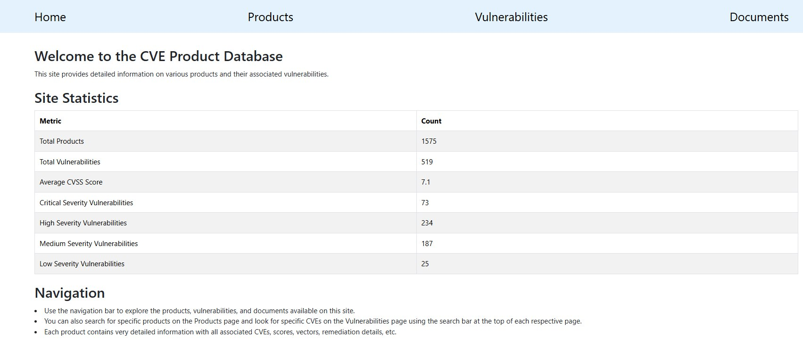
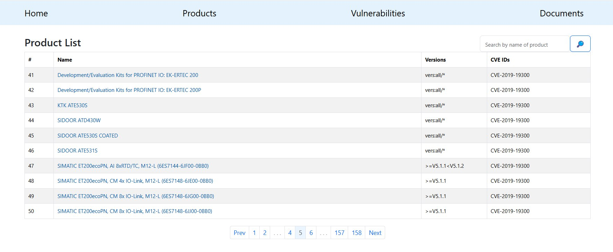
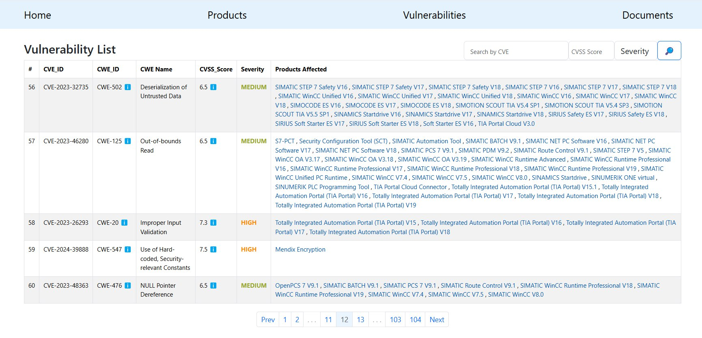

# Siemens Security Advisories

This web application provides a database of security issues reported for Siemens products. The reports were scraped from
Siemens' official
website [here](https://www.siemens.com/global/en/products/services/cert.html#SiemensSecurityAdvisories) and stored in
the application's database.

## Getting Started

To set up this project on your local machine, follow these steps:

### 1. Clone the repository and navigate to the directory:

```shell
git clone https://github.com/alonasorochynska/siemens-security-advisories.git
cd siemens-security-advisories
```

### 2. Create and activate a virtual environment:

```shell
# macOS/Linux
python3 -m venv venv
source venv/bin/activate
# Windows
python -m venv venv
venv\Scripts\activate
```

### 3. Install the required packages:

```shell
pip install -r requirements.txt
```

## Scraping Security Reports

### 1. Run the scraping script to scrape reports:

```shell
python scraper/scrape_reports.py
```

* Note: Ensure that ChromeDriver is installed and configured correctly. The script is set to scrape reports from the
  first 2 pages by default due to the large volume of data. If you need to scrape more pages, edit the
  scrape_reports.py file by adjusting the value in the while loop within the main function.

### 2. After the script completes, run the following commands to migrate the database and import the scraped data:

```shell
python manage.py migrate
python manage.py import_siemens_reports
```

## Running the Application

To start the development server, use the following command:

```shell
python manage.py runserver
```

## Application Features

* <b>Home Page</b>: Displays statistics related to the database data.
* <b>Products Page</b>: Lists all products with related data, including references to product details and support
  pages (if available). Includes search functionality by product name and pagination.
* <b>Product Detail Page</b>: All detailed information related to product.
* <b>Vulnerabilities Page</b>: Lists vulnerabilities with details, including search functionality by CVE, CVSS Score,
  and Severity, allowing multi-field search and pagination.
* <b>Vulnerability Detail Page</b>: All detailed information related to vulnerability.
  * Pop-up window with CVSS details.
* <b>CVSS Vector Page</b>: Page to search products by CVSS Vector.
  * Pop-up window with CVSS Vectors connected to product.
* <b>Documents Page</b>: Lists all scraped documents that were used to create the database.

## Examples

Examples of using the application, including screenshots of pages, are located in the [docs](./docs) directory.

**Home Page**<br>


**Products Page**<br>
  

**Product Detail Page**<br>

**Vulnerabilities Page**<br>
  

**Vulnerability Detail Page**<br>

**CVSS Vector Page**<br>

<hr>

Enjoy using this site!